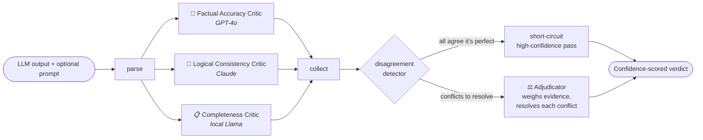

# ⚖️ LLM Output Arbitration System

**A multi-agent pipeline that catches bad answers.** It takes any LLM-generated
output, routes it to three *competing* critic models that independently evaluate
it for **accuracy**, **logic**, and **completeness**, detects where those critics
disagree, and has an **adjudicator** synthesise their critiques into a single
**confidence-scored verdict** with actionable callouts.

> Most portfolio projects build a system that *generates* answers. This one
> builds a system that *audits* them — the evaluation mindset AI teams hire for
> but rarely see in candidates.

The whole system runs **end-to-end offline with zero API keys** (a deterministic
mock backend stands in for the models), and transparently upgrades to real
GPT‑4o / Claude / local Llama when you provide credentials.

---

## The core idea: a panel, not a self-review

A single model reviewing its own work shares its own blind spots. This system
runs **three different models on three different dimensions in parallel** and
treats their **disagreements as the most valuable signal**:



The three critics **fan out in parallel** (not sequentially) and **fan back in**
when all results are collected. If they unanimously agree the output is perfect,
the adjudicator is **short-circuited**. If a critic's API call fails, the system
**degrades gracefully** and still produces a verdict from the survivors, noting
the reduced confidence.

---

## Tech stack

| Component | Tool / Library | Why |
|---|---|---|
| Language | Python 3.11+ | Ecosystem standard |
| Agent framework | LangGraph | State-graph orchestration with real parallel fan-out |
| LLM providers | OpenAI + Anthropic + Ollama | Multi-provider comparison is the point |
| Structured output | Pydantic + `instructor` | Type-safe LLM outputs end to end |
| Storage | SQLite + JSON | Full audit trail for every arbitration |
| API | FastAPI | Production-grade serving with OpenAPI |
| UI | Streamlit | Verdict Explorer with inline annotations |

---

## Quickstart (offline, no API keys)

```bash
pip install -r requirements.txt

# 1) Run the four canonical portfolio cases and print their verdicts
python -m examples.demo

# 2) Run the test suite (41 tests, fully offline)
pytest

# 3) Launch the API  ->  http://localhost:8000/docs
uvicorn arbiter.api:app --reload

# 4) Launch the Verdict Explorer UI  ->  http://localhost:8501
streamlit run ui/streamlit_app.py
```

Or use the one-shot library call:

```python
from arbiter import run_arbitration

result = run_arbitration(
    output="The sun revolves around the earth. Everyone knows water boils at 50°C.",
    prompt="State a couple of science facts.",
)
print(result.verdict.quality_score, result.verdict.confidence)   # -> 1 0.75
for issue in result.verdict.confirmed_issues:
    print(issue.dimension, issue.severity, issue.problem)
```

---

## Using real models

Routing is per-critic and env-driven. The spec's recommended routing —
**accuracy → GPT‑4o, logic → Claude, completeness → local Llama** — is the
default intent; in `auto` mode any critic whose backend is unavailable silently
falls back to the mock so the pipeline always runs.

```bash
cp .env.example .env      # then edit:

ARBITER_ACCURACY_BACKEND=openai       # gpt-4o
ARBITER_LOGIC_BACKEND=anthropic       # claude
ARBITER_COMPLETENESS_BACKEND=ollama   # local llama
ARBITER_ADJUDICATOR_BACKEND=anthropic
ARBITER_BACKEND_MODE=auto             # or "strict" to error on unavailable

OPENAI_API_KEY=sk-...
ANTHROPIC_API_KEY=sk-ant-...
OLLAMA_HOST=http://localhost:11434
```

Every model is constrained to emit a Pydantic model directly via `instructor`,
so outputs are type-safe regardless of provider.

---

## Run the whole stack with Docker

```bash
docker compose up --build
```

This starts the FastAPI service (`:8000`), the Streamlit UI (`:8501`), and a
local **Ollama** container that pulls a Llama model for the completeness critic —
so reviewers can run the **full multi-model system without paid API keys**.
Provide `OPENAI_API_KEY` / `ANTHROPIC_API_KEY` in your environment to light up
the accuracy and logic critics too.

---

## API

Interactive docs at `/docs`, raw spec at `/openapi.json`.

| Method | Path | Purpose |
|---|---|---|
| `POST` | `/v1/arbitrate` | Arbitrate one output (`{output, prompt?}`) → full verdict |
| `POST` | `/v1/arbitrate/batch` | Arbitrate many outputs at once |
| `GET` | `/v1/arbitrations/{id}` | Retrieve a past verdict (full audit record) |
| `GET` | `/v1/arbitrations` | List past arbitrations |
| `GET` | `/v1/analytics` | Critic-behaviour meta-analysis |
| `GET` | `/health` | Service + effective backend routing |

```bash
curl -X POST localhost:8000/v1/arbitrate \
  -H 'content-type: application/json' \
  -d '{"output":"The Great Wall is visible from space. Everyone knows that.",
       "prompt":"Tell me a fact about the Great Wall."}'
```

---

## The Verdict Explorer UI (Phase 4)

- **Main verdict view** — the original output with **inline colour-coded
  annotations**: 🔴 red for confirmed issues, 🟡 amber for low-confidence /
  dismissed flags, 🟢 green for explicitly validated claims. Hover any marker for
  its full evidence chain, or expand the list beneath.
- **Critic comparison panel** — all three critics side by side, with
  **agreements highlighted green and disagreements orange**, so the multi-agent
  architecture is immediately legible.
- **Batch mode** — submit many outputs and browse a **sortable results table**
  (excerpt, score, issues found, confidence), then drill into any one.

---

## Analytics — the meta-analysis (Phase 5.2)

Over many arbitrations `GET /v1/analytics` (and the UI's Analytics tab) reports:

- which critic **finds the most issues**,
- which critic the adjudicator **overrules most often**,
- the **most common failure types**, and
- how often the critics **agree vs. disagree**.

This is the punchline of the whole project: it *quantifies* the payoff of a
multi-model panel over single-model self-evaluation.

---

## The four canonical test cases (Phase 6.1)

`python -m examples.demo --write` runs the system against the four cases below
and writes the full verdicts to [`docs/sample_verdicts.md`](docs/sample_verdicts.md).

| Case | What it is | Verdict (mock backend) |
|---|---|---|
| Factually incorrect | Planted errors (geocentric, wrong boiling point…) | **1/10** — accuracy critic catches them |
| Logically flawed | Appeal to popularity, slippery slope, ad hominem | **5/10** — logic critic catches the fallacies |
| Misses the point | Technically answers but ignores most of the prompt | **7/10** — completeness critic flags the gap |
| Genuinely good | Correct, complete, well-reasoned | **10/10** — unanimous short-circuit pass |

Each case is asserted in [`tests/test_cases.py`](tests/test_cases.py): the *right*
critic catches the *right* kind of problem.

---

## Project structure

```
arbiter/
  models.py          Pydantic models — the type-safe spine + audit schema
  config.py          Env-driven per-critic backend routing
  prompts.py         Critic + adjudicator prompt templates
  providers/         Backend abstraction
    llm.py             OpenAI / Anthropic / Ollama via `instructor`
    mock.py            deterministic offline backend + adjudication policy
    heuristics.py      rule-based critique engine powering the mock
    registry.py        factory + auto/strict fallback
  critics.py         The three critics (retry + graceful degradation)
  disagreement.py    Disagreement detector + short-circuit condition
  adjudicator.py     The adjudicator agent
  graph.py           LangGraph state graph (parallel fan-out/fan-in)
  pipeline.py        run_arbitration() — graph + plain-Python fallback
  storage.py         SQLite index + per-arbitration JSON audit files
  analytics.py       Cross-arbitration critic-behaviour meta-analysis
  api.py             FastAPI service
ui/
  streamlit_app.py   Verdict Explorer
  annotate.py        inline-annotation HTML renderer (unit-tested)
examples/demo.py     the four canonical cases
tests/               41 tests, fully offline
docs/                architecture, narrative, generated sample verdicts
docker-compose.yml   FastAPI + Streamlit + Ollama
```

See [`docs/ARCHITECTURE.md`](docs/ARCHITECTURE.md) for the design deep-dive and
[`docs/NARRATIVE.md`](docs/NARRATIVE.md) for the portfolio write-up.

---

## Testing

```bash
pytest          # 41 tests: models, heuristics, disagreement, pipeline,
                # graceful degradation, the four cases, and the API — all offline
```

## License

MIT
