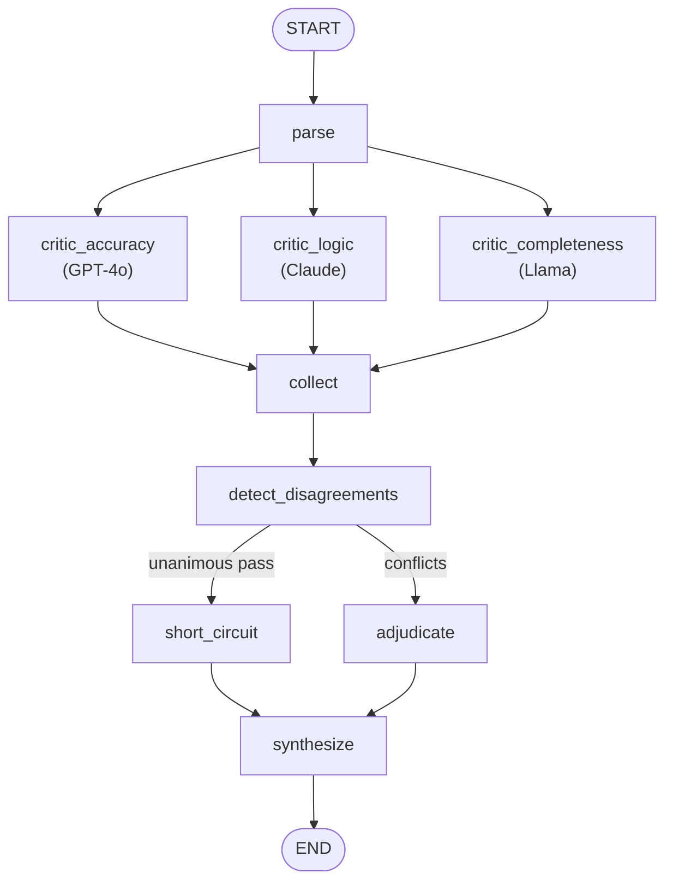

# Architecture

The system is a **LangGraph state graph** that fans an LLM output out to three
independent critic agents, detects where they disagree, and routes the result to
an adjudicator (or short-circuits it). Every hop produces a validated Pydantic
model, and the whole record is persisted as an audit trail.

## The graph



- **`parse`** — input normalisation.
- **`critic_*`** — the three critic nodes. They share no state and run in the
  **same superstep** (true parallel dispatch). Each writes to the `reports` key,
  which uses an **additive reducer** (`Annotated[list, operator.add]`) so the
  concurrent writes merge on fan-in instead of clobbering one another.
- **`collect`** — fan-in join. Because all three critic nodes have an edge into
  it, LangGraph waits for all of them before running it.
- **`detect_disagreements`** — compares critiques (see below) and decides
  whether to short-circuit.
- **`short_circuit` vs `adjudicate`** — a conditional edge. Unanimous flawless
  pass → skip the adjudicator entirely and emit a high-confidence pass. Otherwise
  the adjudicator weighs the evidence.
- **`synthesize`** — final node where post-processing/validation lives.

> If LangGraph isn't installed, `pipeline.run_arbitration` falls back to an
> equivalent plain-Python orchestrator (`ThreadPoolExecutor` for the parallel
> dispatch) with identical semantics, so the core is never blocked on the
> dependency.

## Layers

| Layer | Module | Responsibility |
|---|---|---|
| Models | `arbiter/models.py` | Type-safe spine: `Issue`, `Critique`, `Disagreement`, `Verdict`, `ArbitrationResult`. Also the API + audit schema. |
| Providers | `arbiter/providers/` | `Backend` abstraction. Real backends (`llm.py`) use `instructor`; the `mock` backend (`mock.py` + `heuristics.py`) is deterministic and offline. `registry.py` handles `auto`/`strict` fallback. |
| Critics | `arbiter/critics.py` | One critic per dimension, each bound to its own backend, each owning retry + graceful degradation. |
| Detection | `arbiter/disagreement.py` | Four disagreement kinds + the short-circuit predicate. |
| Adjudication | `arbiter/adjudicator.py` | Evidence-weighing agent + the short-circuit verdict builder. |
| Orchestration | `arbiter/graph.py`, `state.py`, `pipeline.py` | LangGraph graph + plain fallback + the `run_arbitration` entry point. |
| Persistence | `arbiter/storage.py` | SQLite index + per-run JSON audit files. |
| Analytics | `arbiter/analytics.py` | Cross-arbitration critic-behaviour meta-analysis. |
| Serving | `arbiter/api.py` | FastAPI + OpenAPI. |
| UI | `ui/` | Streamlit Verdict Explorer + tested annotation renderer. |

## Structured critiques (Phase 1.2)

Each critic returns a `Critique`:

```python
Critique(
    dimension = accuracy | logic | completeness,
    score     = 1..5,                 # overall on this dimension
    issues    = [Issue(quote, problem, severity=1..5), ...],
    confidence= 0.0..1.0,             # the critic's confidence in itself
    summary   = "...",
)
```

`instructor` coerces every model — GPT‑4o, Claude, or Llama — into exactly this
shape, so the pipeline is type-safe no matter which provider served the critic.

## Disagreement detection (Phase 2.3)

After collection, the detector surfaces four kinds of conflict:

| Kind | Trigger |
|---|---|
| `score_divergence` | overall dimension scores span **> 2 points** |
| `severity_conflict` | two critics quote **overlapping text** but rate severity **> 2 points** apart |
| `unique_finding` | a **severity ≥ 3** issue exactly one critic raised and the others missed |
| `existence` | one critic passes the output clean while another flags a serious problem |

These are exactly the cases a single model's self-review would miss — which is
the project's thesis.

## Edge cases (Phase 2.4)

- **A critic's backend fails** → it retries with exponential backoff
  (`ARBITER_MAX_RETRIES`, `ARBITER_RETRY_BACKOFF`); if it still fails, it returns
  a `CriticReport(ok=False, error=...)`. The graph continues, the adjudicator is
  told the dimension is missing, `degraded=True`, and confidence is reduced.
- **All critics agree it's perfect** → the adjudicator is short-circuited and a
  high-confidence pass is returned without a model call.
- **The adjudicator backend fails** → a deterministic mock synthesis is used as a
  last resort so the pipeline always returns a verdict.

## Adjudication (Phase 3)

The adjudicator receives the original output, all three critic reports, and the
list of detected disagreements, and is prompted to reason through each
disagreement explicitly — verifying factual claims, tracing reasoning chains, and
re-reading the prompt for completeness conflicts. It emits a `Verdict`:

```python
Verdict(
    quality_score    = 1..10,
    confidence       = 0.0..1.0,
    confirmed_issues = [ConfirmedIssue(..., evidence, raised_by)],
    dismissed_flags  = [DismissedFlag(..., reasoning)],   # overruled critic flags
    validated_claims = [ValidatedClaim(quote, note)],     # explicitly endorsed
    summary          = "one paragraph",
)
```

## The mock backend

The mock is **not** a fake pass-through — it is a transparent, rule-based
critique engine (`heuristics.py`) with a distinct detector per dimension
(factual-error tables + numeric fact checks for accuracy, fallacy patterns for
logic, coverage/hand-wave detection for completeness) plus a deterministic
adjudication policy (`mock.py`). That is what makes the system genuinely runnable
and testable offline, and what powers the 41-test suite.
