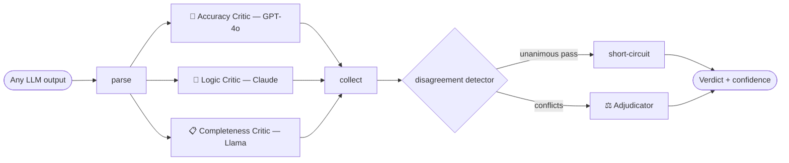

# I built a system where AI models audit each other's work.

**Three specialised critics independently evaluate any LLM output, and an
adjudicator resolves their disagreements into a single confidence-scored
verdict.**

Most AI projects generate answers. This one catches bad ones.

---

## The architecture: a parallel fan-out of critics

The design choice that matters: **the three critics run different models on
different dimensions, in parallel.** A single model reviewing its own work shares
its own blind spots — if it doesn't know a fact is wrong, it won't catch the
error and it won't catch itself failing to catch it. Three different models,
each specialised and each with its own training blind spots, catch far more
between them. **Their disagreements are the most valuable signal in the system**,
and an adjudicator is prompted to reason through each one explicitly — verifying
facts, tracing reasoning chains, and re-reading the prompt — before it commits to
a verdict.

## What it produces

For every output, a structured, audit-logged verdict:

- an overall **quality score (1–10)** and a **confidence level**,
- **confirmed issues** with severity and the adjudicator's evidence,
- **dismissed flags** — issues one critic raised but the adjudicator overruled,
  with its reasoning, and
- **validated claims** it explicitly checked and endorsed.

The Verdict Explorer UI renders the original text with inline, colour-coded
markers (red confirmed, amber dismissed, green validated) and a side-by-side
critic comparison panel that makes the multi-agent structure legible at a glance.

## It handles the messy parts

- **A critic's API call fails?** It retries, then degrades gracefully — the
  verdict still comes from the surviving critics, with reduced confidence and a
  note about the missing dimension.
- **All three critics agree it's perfect?** The adjudicator is short-circuited
  and the output gets a high-confidence clean pass — no wasted call.

## The payoff, quantified

Run the four canonical cases (`python -m examples.demo`) and the verdicts line up
exactly with the failure modes:

| Output | Verdict | Who caught it |
|---|---|---|
| Planted factual errors | **1/10** | the **accuracy** critic |
| Fallacious argument | **5/10** | the **logic** critic |
| Answers but misses the point | **7/10** | the **completeness** critic |
| Genuinely good answer | **10/10** | unanimous short-circuit pass |

And the meta-analysis over many arbitrations (`GET /v1/analytics`) is the closing
argument: it tracks **which critic finds the most issues, which gets overruled
most often, the most common failure types, and how often the critics disagree.**
In the demo run the critics disagreed on **75%** of outputs — every one of those
disagreements is an issue that at least one critic caught and the others missed.
That is the number a single-model self-evaluation can never show you, because it
has no second opinion to disagree with.

**Multi-model critique catches what single-model self-evaluation misses — and
this system measures exactly how much.**

---

*Built with LangGraph (orchestration), Pydantic + `instructor` (type-safe
structured outputs from every model), FastAPI (serving), SQLite + JSON (audit
trail), and Streamlit (the Verdict Explorer). Runs fully offline with a
deterministic mock backend, or against real GPT‑4o / Claude / local Llama with
API keys.*
